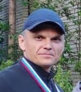

# Danilchik Sergey 


### Contacts
[Email](mailto:fendansas@gmail.com)
### About me
In this course, I aim to master JavaScript.
Currently, I work as a PHP developer, but my journey into programming began with a thirst for learning new things. Embracing the unknown is what led me to this profession and now, I’m ready to tackle fresh challenges head-on. Every obstacle is just another opportunity to grow.
### Skills

__Backend__
- PHP, Laravel, Symfony

__Frontend__
- HTML, CSS

__CMS__
- WordPress

### Code
```javascript
function multiply(a, b){
  return a * b
}
```
### Project
[My first cv.md ](https://github.com/Fendansas/rsschool-cv/blob/gh-pages/cv.md)
